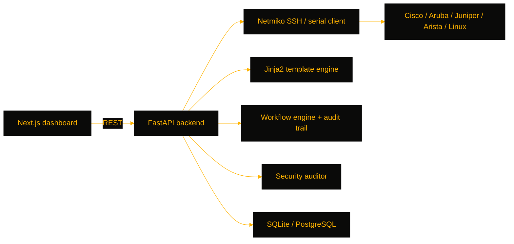

# nethermind

> AI-assisted management console for mixed-vendor network switches — SSH/serial config operations, Jinja2 templating, and security auditing for network engineers and MSPs running heterogeneous fleets.

[](https://github.com/OneByJorah/nethermind)
[](https://github.com/OneByJorah/nethermind)
[](https://github.com/OneByJorah/nethermind/stargazers)
[](https://github.com/OneByJorah/nethermind/commits)
[](https://github.com/OneByJorah/nethermind/actions)

## What This Is

Managing Cisco, Aruba, Juniper, and Arista gear usually means bouncing between SSH sessions and hand-edited configs. nethermind pulls that work into one app: it connects over SSH or a serial console, parses running-configs into structured data, renders new configs from templates, and logs every change behind an approval workflow. It is built for network engineers and MSPs who want an audit trail behind every change to a mixed-vendor fleet.

## Quick Start

```bash
git clone https://github.com/OneByJorah/nethermind.git && cd nethermind
cp .env.example .env   # set OPENAI_API_KEY and SSH credentials
docker compose up -d
```

Open **http://localhost:3000** for the web UI, or **http://localhost:8000/docs** for the API.

## Features

- Pulls and backs up running configs over Netmiko SSH or a pyserial RS-232/USB console
- Parses existing running-config text into structured data for editing and re-rendering
- Ships 50+ Jinja2 config templates for Aruba, Cisco, and generic devices
- Diff and rollback for config versions, with SHA-tracked snapshots
- IRIS-style workflow engine gates risky changes behind human approval steps
- Security auditing: CVE scanning, AAA/ACL checks, CIS/NIST-oriented findings
- OpenAI-powered chat agent with tool calling for natural-language switch operations
- Device health metrics (CPU, memory, interface status) and a topology view
- Optional Electron desktop build bundling backend and frontend

## Architecture



## Stack

FastAPI, SQLAlchemy, Netmiko, pyserial, Jinja2, OpenAI SDK, Next.js (TypeScript), Tailwind CSS, Electron, SQLite/PostgreSQL, Docker Compose.

## Contributing

Contributions are welcome — read [CONTRIBUTING.md](CONTRIBUTING.md), then [open an issue](https://github.com/OneByJorah/nethermind/issues).

## License

MIT — see LICENSE.
